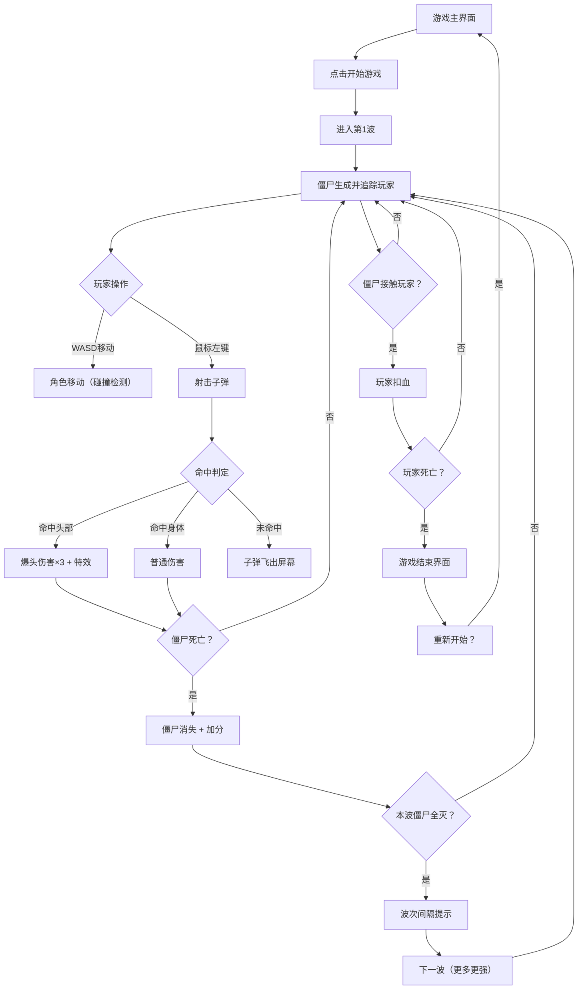

## 1. 产品概述
僵尸生存射击是一款俯视角2D射击生存游戏，玩家在封闭场景中操控角色，使用WASD移动、鼠标瞄准射击，抵御从四面八方涌来的僵尸波次进攻。存活波数越多，分数越高。
- 目标用户：喜欢射击类、生存类休闲游戏的玩家
- 核心价值：紧张刺激的波次生存体验，简单上手但具有策略深度（爆头机制）

## 2. 核心功能

### 2.1 用户角色
| 角色 | 说明 |
|------|------|
| 玩家 | 操控角色在封闭场景中移动射击，抵御僵尸波次 |

### 2.2 功能模块
1. **游戏主界面**: 开始游戏按钮、游戏标题、操作说明
2. **游戏场景**: 俯视角封闭战场、玩家角色、僵尸、子弹、血迹特效
3. **游戏HUD**: 血条、弹药、当前波次、分数、爆头提示
4. **游戏结束界面**: 最终分数、存活波数、重新开始按钮

### 2.3 页面详情
| 页面名称 | 模块名称 | 功能描述 |
|----------|----------|----------|
| 游戏主界面 | 标题与氛围 | 显示游戏标题"僵尸生存射击"，血腥风格背景，操作说明面板 |
| 游戏主界面 | 开始按钮 | 点击开始游戏，进入第一波 |
| 游戏场景 | 俯视角战场 | Canvas渲染的封闭矩形场景，地面纹理，四周墙壁 |
| 游戏场景 | 玩家角色 | 俯视角人物，朝向跟随鼠标，WASD移动，碰撞墙壁边界 |
| 游戏场景 | 射击系统 | 鼠标左键射击，子弹沿鼠标方向飞行，命中僵尸造成伤害 |
| 游戏场景 | 爆头判定 | 僵尸头部区域命中伤害×3，显示爆头特效与提示 |
| 游戏场景 | 僵尸AI | 僵尸从场景边缘生成，自动追踪玩家，接触玩家造成伤害 |
| 游戏场景 | 波次系统 | 每波僵尸全部消灭后进入下一波，僵尸数量和速度递增 |
| 游戏HUD | 状态面板 | 左上角血条、右上角波次和分数、弹药显示 |
| 游戏HUD | 爆头提示 | 爆头时屏幕中央弹出"HEADSHOT!"文字特效 |
| 游戏结束界面 | 结算面板 | 显示最终分数和存活波数，重新开始按钮 |

## 3. 核心流程

玩家打开游戏 → 显示主界面 → 点击开始 → 进入第1波 → 僵尸从四面八方生成并追踪玩家 → 玩家WASD移动+鼠标射击 → 僵尸被消灭/碰到玩家扣血 → 当前波次僵尸全部消灭 → 短暂休息提示"第N波即将来临" → 下一波僵尸更多更强 → 玩家血量归零 → 游戏结束 → 显示结算 → 可重新开始

## 4. 用户界面设计

### 4.1 设计风格
- **主色调**: 暗红(#8B0000) + 深灰(#1a1a1a) + 毒绿(#39FF14)
- **辅助色**: 血红(#FF0000)、骨骼白(#E8D5B7)、暗紫(#4A0E4E)
- **按钮风格**: 粗犷质感，暗红色3D立体按钮，hover发光效果
- **字体**: 标题使用粗犷力量感字体，正文使用清晰易读字体
- **布局**: 全屏Canvas游戏区域，HUD叠加层
- **特效风格**: 血液飞溅、弹壳掉落、爆头慢动作提示

### 4.2 页面设计概览
| 页面名称 | 模块名称 | UI元素 |
|----------|----------|--------|
| 游戏主界面 | 标题区 | 超大血腥风格标题，暗红渐变背景，闪烁霓虹毒绿色副标题 |
| 游戏主界面 | 操作说明 | WASD键位图标，鼠标图标，简洁操作说明文字 |
| 游戏主界面 | 开始按钮 | 大号暗红3D按钮，脉动动画，hover发光 |
| 游戏场景 | 战场 | 深灰色地面网格纹理，四周墙壁，暗角vignette效果 |
| 游戏场景 | 玩家 | 俯视角圆形角色，方向指示器朝向鼠标 |
| 游戏场景 | 僵尸 | 俯视角绿色/灰色角色，不同类型有不同大小和颜色 |
| 游戏场景 | 子弹 | 明亮黄色弹道，命中产生血色粒子 |
| 游戏HUD | 血条 | 左上角红色长条血条，数值显示 |
| 游戏HUD | 波次/分数 | 右上角毒绿色数字，波次切换时放大动画 |
| 游戏HUD | 爆头提示 | 屏幕中央"HEADSHOT!"红色大字，渐隐消失 |
| 游戏结束界面 | 结算面板 | 暗红半透明遮罩，白色大字分数，波数统计 |
| 游戏结束界面 | 重新开始 | 暗红3D按钮，与主界面风格一致 |

### 4.3 响应式
- 桌面优先设计，Canvas自适应窗口大小
- 最小分辨率支持1280×720

### 4.4 游戏场景设计
- 俯视角2D渲染，Canvas全屏
- 封闭矩形场景，带墙壁碰撞
- 地面使用深色网格纹理营造氛围
- 暗角vignette效果增强恐怖氛围
- 血迹和弹孔残留在地面
- 粒子系统：血液飞溅、爆头特效、弹壳
