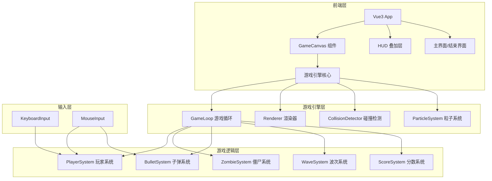

## 1. 架构设计



## 2. 技术说明
- **前端框架**: Vue3 + TypeScript
- **构建工具**: Vite
- **样式方案**: Tailwind CSS
- **游戏渲染**: HTML5 Canvas 2D
- **状态管理**: Vue3 reactive + composable 模式
- **无后端**: 纯前端单机游戏

## 3. 路由定义
| 路由 | 用途 |
|------|------|
| / | 游戏主页面（包含主界面、游戏场景、结束界面三个状态） |

## 4. 游戏引擎架构

### 4.1 核心模块

| 模块 | 职责 |
|------|------|
| GameLoop | requestAnimationFrame驱动的60fps游戏主循环，管理update和render |
| Renderer | Canvas 2D渲染，分层绘制（地面→血迹→僵尸→玩家→子弹→粒子→HUD） |
| InputManager | 统一管理键盘和鼠标输入，提供查询接口 |
| CollisionDetector | AABB和圆形碰撞检测，子弹-僵尸、僵尸-玩家碰撞 |
| ParticleSystem | 粒子效果管理（血液飞溅、爆头特效） |

### 4.2 游戏实体

| 实体 | 属性 |
|------|------|
| Player | x, y, angle, hp, maxHp, speed, invincibleTimer |
| Zombie | x, y, hp, maxHp, speed, type, headRadius, bodyRadius, damage |
| Bullet | x, y, vx, vy, damage, isHeadshot |
| Particle | x, y, vx, vy, life, maxLife, color, size |

### 4.3 波次配置

| 波次 | 僵尸数量 | 僵尸速度倍率 | 僵尸血量倍率 |
|------|----------|-------------|-------------|
| 1 | 5 | 1.0 | 1.0 |
| 2 | 8 | 1.1 | 1.1 |
| 3 | 12 | 1.2 | 1.2 |
| 4 | 16 | 1.3 | 1.3 |
| 5+ | 16+(wave-4)*3 | 1.0+wave*0.1 | 1.0+wave*0.1 |

### 4.4 伤害系统

| 命中部位 | 伤害倍率 | 特效 |
|----------|----------|------|
| 头部 | ×3 | 爆头特效+HEADSHOT文字 |
| 身体 | ×1 | 血液飞溅 |
| 僵尸接触玩家 | 固定10点 | 屏幕闪红 |

## 5. 项目文件结构

```
src/
├── App.vue                    # 主应用组件
├── main.ts                    # 入口文件
├── components/
│   ├── GameCanvas.vue         # Canvas游戏画布组件
│   ├── GameHUD.vue            # 游戏HUD叠加层
│   ├── MainMenu.vue           # 主界面
│   └── GameOver.vue           # 游戏结束界面
├── composables/
│   ├── useGameEngine.ts       # 游戏引擎核心composable
│   ├── usePlayer.ts           # 玩家逻辑
│   ├── useZombie.ts           # 僵尸逻辑
│   ├── useBullet.ts           # 子弹逻辑
│   ├── useWave.ts             # 波次逻辑
│   ├── useScore.ts            # 分数逻辑
│   ├── useInput.ts            # 输入管理
│   └── useParticle.ts         # 粒子系统
├── game/
│   ├── types.ts               # 游戏类型定义
│   ├── constants.ts           # 游戏常量配置
│   ├── renderer.ts            # Canvas渲染器
│   └── collision.ts           # 碰撞检测
├── assets/
│   └── styles/
│       └── game.css           # 游戏专用样式
└── style.css                  # 全局样式
```

## 6. 性能优化策略
- 对象池复用：子弹和粒子使用对象池，避免频繁GC
- 空间分区：僵尸数量多时使用网格空间分区优化碰撞检测
- 离屏Canvas：地面纹理和血迹绘制到离屏Canvas，减少重绘
- 视口裁剪：只渲染视口内的实体
